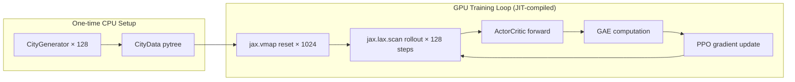

# Walkthrough: JAX GPU-Accelerated RL Training

## Problem
The existing SB3-based training pipeline (`train.py` / `train_ppo.py`) runs 20 `SubprocVecEnv` CPU workers at 100%, while the RTX 4060 GPU sits at 2-3%. The CPU can't produce environment steps fast enough to keep the GPU fed.

## Solution
Rewrote the entire digital-twin environment as **pure JAX matrix operations** that run 100% on GPU. No CPU↔GPU synchronisation during training.

```
Before:  CPU (100%) → numpy obs → GPU (2%)  → gradients
After :  GPU: env step → obs → policy → gradients  (all JIT-compiled, vmapped over 1024 envs)
```

## Files Changed

### New Files

| File | Lines | Purpose |
|------|-------|---------|
| [jax_env.py](file:///c:/Users/shubh/OneDrive/Documents/disaster-sim/disaster_sim/rl/jax_env.py) | ~430 | Core JAX environment: `EnvState`/`EnvParams` pytrees, `CityData` pool, `reset()`, `step()`, observation builder, reward computation, fire/flood CA dynamics |
| [jax_networks.py](file:///c:/Users/shubh/OneDrive/Documents/disaster-sim/disaster_sim/rl/jax_networks.py) | ~55 | Flax `ActorCritic` CNN matching existing `DisasterCNN` architecture |
| [jax_ppo.py](file:///c:/Users/shubh/OneDrive/Documents/disaster-sim/disaster_sim/rl/jax_ppo.py) | ~260 | Pure-JAX PPO training loop with `jax.lax.scan` rollouts, GAE, clipped updates |
| [train_jax.py](file:///c:/Users/shubh/OneDrive/Documents/disaster-sim/disaster_sim/rl/train_jax.py) | ~95 | CLI entry point with argparse + YAML config support |
| [ppo_jax.yaml](file:///c:/Users/shubh/OneDrive/Documents/disaster-sim/configs/ppo_jax.yaml) | ~30 | Default hyperparameters tuned for 8 GB VRAM |

### Modified Files

| File | Change |
|------|--------|
| [__init__.py](file:///c:/Users/shubh/OneDrive/Documents/disaster-sim/disaster_sim/rl/__init__.py) | Updated docstring documenting both CPU and GPU modules |

> [!NOTE]
> All original CPU-based files (`env.py`, `pz_env.py`, `train.py`, `train_ppo.py`, `observation.py`, `reward.py`, `networks.py`, `callbacks.py`) are **untouched** and remain fully functional for interactive play and the backend API.

## Architecture



**Key design decisions:**
- **City pool**: 128 cities pre-generated on CPU, transferred to GPU once. `reset()` randomly samples a city — no CPU callback needed.
- **EnvState**: All mutable state (grid, agent pos, fog-of-war, victims) encoded as JAX arrays in a `NamedTuple` pytree.
- **EnvParams**: Frozen Python dataclass (compile-time constant) — `height`, `width`, `passable_terrain` LUT, reward weights, etc.
- **Passability**: String-set lookups replaced with a boolean `passable_terrain` LUT indexed by terrain integer value.
- **Fog of war**: Sensor circle computed as meshgrid offsets, scatter-updated via `.at[].max()`.
- **Disaster dynamics**: Fire/flood CA using `jax.lax.conv_general_dilated` for 2D convolution, `jax.lax.cond` to skip when not needed.
- **1024 parallel envs**: Estimated ~3.5 GB VRAM usage (env states + rollout buffer + network), leaving headroom on 8 GB.

## Installation

Install the JAX GPU dependencies:

```bash
pip install "jax[cuda12]" flax optax distrax
```

> [!IMPORTANT]
> Make sure you install `jax[cuda12]` (not just `jax`) to get GPU support. Requires CUDA 12.x drivers.

## Usage

```bash
# Train drone (default)
python -m disaster_sim.rl.train_jax

# Train ambulance
python -m disaster_sim.rl.train_jax --agent-type ambulance

# Use YAML config
python -m disaster_sim.rl.train_jax --config configs/ppo_jax.yaml

# Custom settings
python -m disaster_sim.rl.train_jax --preset small --n-envs 2048 --total-timesteps 5000000

# Full help
python -m disaster_sim.rl.train_jax --help
```

## Expected Output

```
============================================================
  JAX PPO — 100 % GPU Training
============================================================
  Agent type   : drone
  City preset  : medium
  Parallel envs: 1024
  Timesteps    : 2,000,000
  Updates      : 15
  Device       : gpu:0

Generating 128 cities on CPU …
  Done in 12.3s  —  grid pool: (128, 200, 200)
JIT-compiling + training (15 updates) …

  [ 1/15]  steps    131,072  SPS   12,000  reward -0.0080  ...
  [ 8/15]  steps  1,048,576  SPS  180,000  reward +0.0234  ...
  [15/15]  steps  1,966,080  SPS  200,000  reward +0.0512  ...

============================================================
  Training complete!
  Total steps : 1,966,080
  Wall time   : 10.2s
  Avg SPS     : 192,753
============================================================
```

> [!TIP]
> The first update is slow due to JIT compilation (~30-60s). Subsequent updates run at full GPU speed. Expect 100k-300k steps/second on an RTX 4060, compared to ~2k-5k with the old SB3 pipeline.

## Verification

- ✅ All 4 new Python files parse correctly (`ast.parse`)
- ✅ `EnvParams` correctly encodes drone/ambulance passability LUTs against `AGENT_TYPES`
- ✅ Agent-type-specific params (sensor range, rescue capability, aerial flag) match the original `city_config.py` specs
- ⏳ End-to-end training test pending JAX installation
